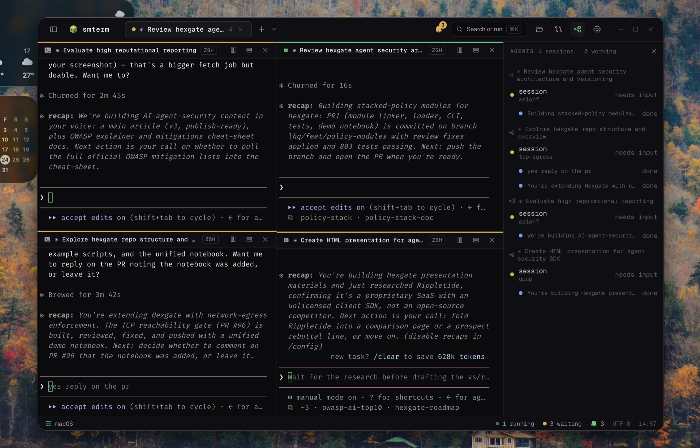

<p align="center">
  
</p>

<h1 align="center">smterm</h1>

<p align="center">A minimal terminal for agentic coding, built to keep you in the loop (yes we love reading the code).</p>

<p align="center">
  <a href="https://github.com/vcmf/smterm/actions/workflows/ci.yml"></a>
  <a href="LICENSE"></a>
  
</p>

<p align="center">If smterm looks useful to you, a ⭐ helps other people find it.</p>

smterm is a fast, cross-platform terminal (tabs, split panes, real shells) for people who run
coding agents all day. It stays out of your way like a normal terminal, then adds a few panels
that show you what the agents are actually doing: git diffs, files, and a live agents board that
works with Claude Code. If you have looked for an open-source Warp alternative, or a tmux built
for coding agents, this is that.

- 🔔 **Notifications when a session needs you.** Working, waiting for input, or done, shown as a
  dot on the tab and in the sidebar, plus a native OS notification when a background pane wants
  you. No more finding a finished agent an hour late.
- 🔍 **Changes panel.** A git diff for the focused pane's working directory, so you can read
  what an agent just touched. Branch and ahead/behind show in the status bar.
- 📁 **Files browser.** A lazy per-folder listing rooted at the focused pane's cwd, with git
  decorations (badges on changed files, tinted folders). Click a file to open it in your editor.
- 🤖 **Agents board.** A live view of the Claude Code agents you launched inside smterm: the
  root session, its sub-agents, what each is doing, its cwd, and its recent files. Click one to
  jump to its pane.
- 🪟 **Real multiplexer.** Tabs and resizable splits. Split a pane and it keeps your shell and
  directory. Quit and reopen and your layout comes back.
- ⌨️ **Command palette (⌘K).** New sessions, splits, theme switching, settings.
- 🎨 **Themes and fonts.** Minimal Dark, Tokyo Night, Catppuccin, Gruvbox; bundled fonts and
  ligatures.

<p align="center">
  
</p>

## Why I built this

I love the terminal, and honestly the easiest way to put an agent like Claude Code to work is
to launch it from a CLI. But I also love reading the code it writes and making the edits
myself, and a plain terminal makes that half hard: you lose track of which session needs you,
and you never really see what changed. So I built the terminal I wanted. It keeps the shell I
already like and adds just enough to stay in the loop: the Changes, Files, and Agents panels
show what happened, not just that something did.

## Works with Claude Code

Run `claude` in any pane and the Agents board lights up: the root session, its sub-agents, what
each is doing, its working directory, and the files it touched. It reads Claude Code's own hook
events, so there is zero setup and no global config to edit; smterm only wires the panes it
launches. Agents started outside smterm do not show up.

## Install

macOS and Linux:

```
curl -fsSL https://raw.githubusercontent.com/vcmf/smterm/main/install.sh | sh
```

Windows (PowerShell):

```
irm https://raw.githubusercontent.com/vcmf/smterm/main/install.ps1 | iex
```

## Also

Beyond the headline features above:

- macOS, Linux, and Windows, with WSL as a first-class shell target
- Copy and paste, find in scrollback (`Cmd`/`Ctrl+Shift` + `F`)
- Collapsible sidebar and a shell picker for new tabs
- The Agents board needs zero setup: it is wired only for panes smterm spawns

## Configuration

Settings live in a single JSON file that is the source of truth. Edit it by hand or through the
in-app settings panel; a live watcher re-applies changes as you save.

- macOS and Linux: `~/.config/smterm/settings.json`
- Windows: `%APPDATA%\smterm\settings.json`

```jsonc
{
  "font": { "family": "JetBrains Mono", "size": 13, "ligatures": true, "lineHeight": 1.2 },
  "theme": "minimal-dark",
  "cursorBlink": true,
  "scrollback": 5000,
}
```

## What is still rough

This is v0. I use it every day, and it will still surprise you sometimes.

- macOS is Apple Silicon only for now. An Intel build is on the list.
- Nothing is code-signed or notarized yet, so expect a security prompt if you go around the
  installer. This is the next thing on the roadmap.
- The "is this agent actually working or just sitting there" detection is a heuristic. It is
  good, not psychic.
- The Agents board is Claude Code specific right now (it reads Claude's own hook events). Other
  agents will come; the underlying reducer is agent-agnostic.
- Windows and WSL work but have had less real-world mileage than macOS and Linux.
- Live processes do not survive a full quit yet. Your layout comes back, your running programs
  do not.

Found a bug? [Open an issue](https://github.com/vcmf/smterm/issues). What you did, what
happened, and what you expected is all it takes for a useful report.

## Build from source

```
git clone https://github.com/vcmf/smterm
cd smterm
make install   # deps, native module rebuild, git hooks
make run       # dev mode
make dist      # package an installable build for your OS
```

Run `make help` for the full list of targets (`make check` runs lint + tests, `make fmt`
formats). Logic lives in small pure modules with real tests (`make test`).

Stack, if you care: Electron, React, TypeScript, xterm.js on the WebGL renderer, and node-pty
for the shells. Zustand for state, react-resizable-panels for the layout, Vitest for tests.
Design and decisions live in [`docs/`](docs/): start with
[ARCHITECTURE.md](docs/ARCHITECTURE.md) and [ROADMAP.md](docs/ROADMAP.md).

## License

[MIT](LICENSE). Do what you want with it.
