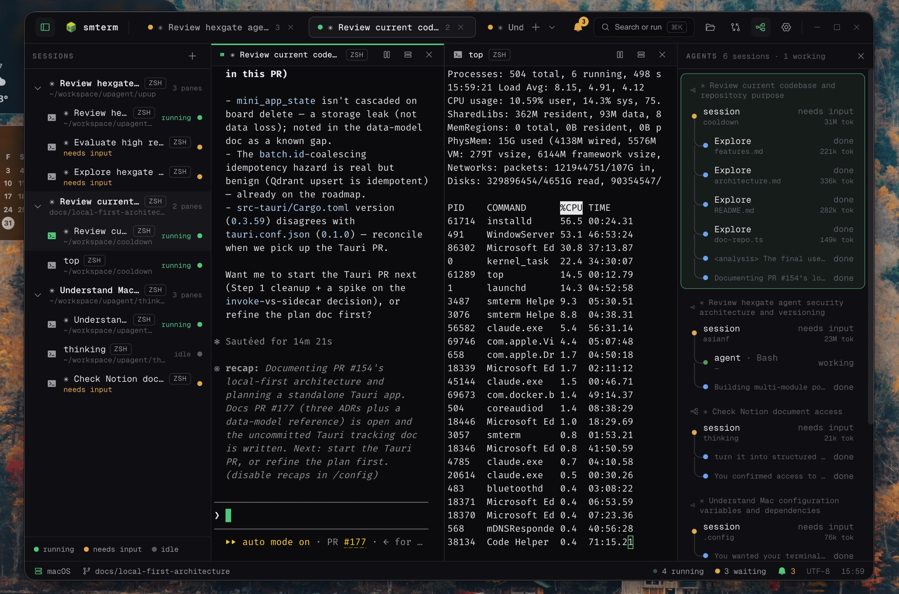
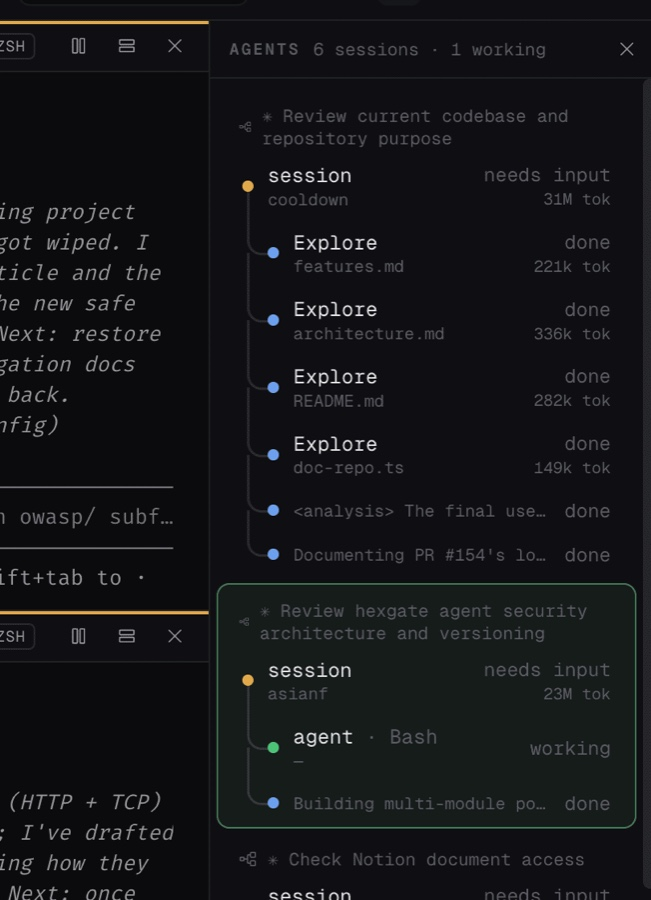
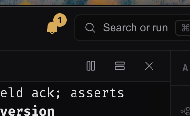
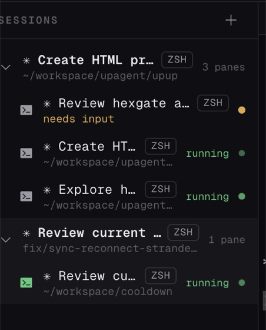
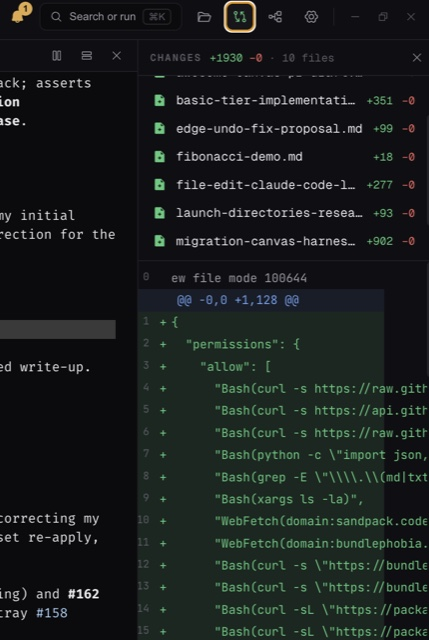
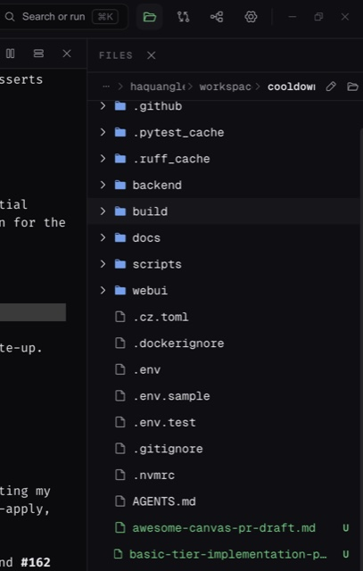
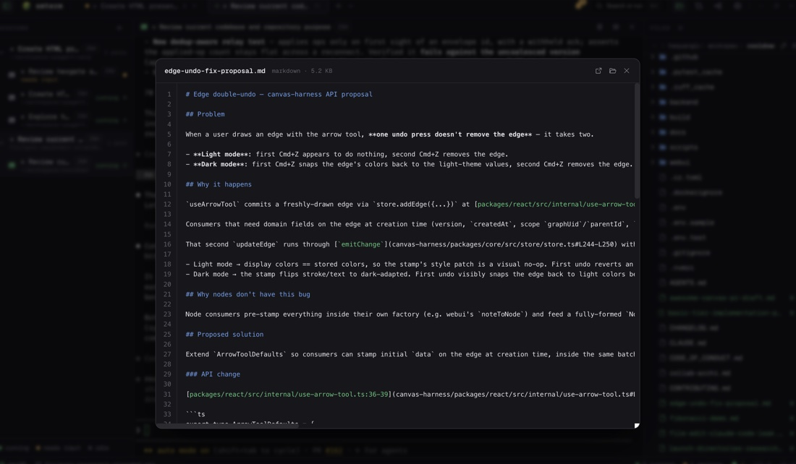

<p align="center">
  
</p>

<h1 align="center">minmux</h1>

<p align="center">A minimal terminal for agentic coding, built to keep you in the loop (yes we love reading the code).</p>

<p align="center">
  <a href="https://github.com/vcmf/minmux/actions/workflows/ci.yml"></a>
  <a href="LICENSE"></a>
  
</p>

<p align="center">If minmux looks useful to you, a ⭐ helps other people find it.</p>

<p align="center">
  
</p>

**minmux** is a fast, cross-platform terminal (tabs, split panes, real shells) for people who run
coding agents all day. It stays out of your way like a normal terminal, then adds a few panels
that show you what the agents are actually doing: git diffs, files, and a live agents board that
works with Claude Code, Codex and OpenCode. If you have looked for an open-source Warp alternative, or a tmux built
for coding agents, this is that.

- 🔔 **Notifications when a session needs you.** Working, waiting for input, or done, shown as a
  dot on the tab and in the sidebar, plus a native OS notification when a background pane wants
  you. No more finding a finished agent an hour late.
- 🔍 **Changes panel.** A git diff for the focused pane's working directory, so you can read
  what an agent just touched. Branch and ahead/behind show in the status bar.
- 📁 **Files browser.** A lazy per-folder listing rooted at the focused pane's cwd, with git
  decorations (badges on changed files, tinted folders). Click a file to open it in your editor.
- 🤖 **Agents board.** A live view of the Claude Code, Codex and OpenCode agents you launched
  inside minmux: the root session, its sub-agents, what each is doing, its cwd, and its recent
  files. Click one to jump to its pane.
- 🪟 **Real multiplexer.** Tabs and resizable splits. Split a pane and it keeps your shell and
  directory. Quit and reopen and your layout comes back.
- 🌐 **SSH hosts in one click.** The hosts in your `~/.ssh/config` are listed in the sidebar.
  Click one for a terminal on it; splits and new terminals from that pane stay on the host. A
  dropped connection says so and reconnects on Enter.
- 🖥️ **Cross-platform.** macOS, Linux, and Windows, with WSL as a first-class shell target.
- ⌨️ **Command palette (⌘K).** New sessions, splits, theme switching, settings.
- 🎨 **Themes and fonts.** Minimal Dark, Tokyo Night, Catppuccin, Gruvbox; bundled fonts and
  ligatures.

## Install

macOS and Linux:

```
curl -fsSL https://raw.githubusercontent.com/vcmf/minmux/main/install.sh | sh
```

Windows (PowerShell):

```
irm https://raw.githubusercontent.com/vcmf/minmux/main/install.ps1 | iex
```

## A closer look

<table>
  <tr>
    <td width="42%"></td>
    <td><b>Agents board.</b> A live tree of the Claude Code, Codex and OpenCode agents you launched: each session, its sub-agents, what they are doing, and token usage. Click one to jump to its pane.</td>
  </tr>
  <tr>
    <td width="42%"></td>
    <td><b>Notifications when a session needs you.</b> A dot on the tab and a native OS notification the moment a background pane wants input or finishes.</td>
  </tr>
  <tr>
    <td width="42%"></td>
    <td><b>Every session and pane at a glance.</b> The sidebar tree shows each session, its panes, and a status dot: running, needs input, or idle.</td>
  </tr>
  <tr>
    <td width="42%"></td>
    <td><b>SSH sessions.</b> Your <code>~/.ssh/config</code> hosts in one picker, recent first. Enter opens a tab, ⌥Enter splits right, ⇧Enter splits down. It runs your own <code>ssh</code>, so keys, agents and 2FA prompts work as usual, and splits stay on the host. <a href="#ssh-hosts">More below.</a></td>
  </tr>
  <tr>
    <td width="42%"></td>
    <td><b>Changes panel.</b> A live git diff for the focused pane's working directory, with per-file counts and the full unified diff.</td>
  </tr>
  <tr>
    <td width="42%"></td>
    <td><b>Files browser.</b> A lazy per-folder listing rooted at the pane's cwd, with git decorations on changed files.</td>
  </tr>
  <tr>
    <td width="42%"></td>
    <td><b>Open a file and read it.</b> Click a file to open an inline preview and read what an agent wrote, without leaving the terminal.</td>
  </tr>
  <tr>
    <td width="42%"></td>
    <td><b>Themes and settings.</b> Minimal, Tokyo Night, Catppuccin and Gruvbox, each in dark and light, or following the system. Fonts, size and line height sit right below, all backed by one <code>settings.json</code>.</td>
  </tr>
</table>

## Works with Claude Code, Codex and OpenCode

Run `claude`, `codex` or `opencode` in any pane and the Agents board lights up: the root session,
its sub-agents, what each is doing, its working directory, the files it touched and its token
use. Quit minmux with an agent running and its session comes back in the same pane when you
reopen it. There is no global config to edit: minmux only wires the panes it launches, so agents
started outside minmux do not show up. Each integration can be switched off in Settings.

- **Claude Code** works with no setup at all.
- **Codex** asks you to approve minmux's hooks once (and again when a minmux update changes
  them). When it does, minmux shows a strip in the pane: type `/hooks` in Codex and press `t`.
  Codex is wired in zsh and bash panes.
- **OpenCode** works with no setup: minmux adds a small plugin to OpenCode in its panes, next to
  your own plugins.

Codex and OpenCode are not wired on Windows or in WSL panes yet.

## Why I built this

I love the terminal, and the easiest way to put an agent like Claude Code to work is to launch
it from a CLI. But I also like reading the code an agent writes and making the edits myself, and
a plain terminal makes that hard: you lose track of which session needs you, and you never
really see what changed. minmux keeps the shell I already like and adds just enough to stay in
the loop: the Changes, Files, and Agents panels show what happened, not just that something did. It also behaves the same on macOS, Linux and WSL, which helps since
my work moves between all three.

## Also

Beyond the headline features above:

- Copy and paste, find in scrollback (`Cmd`/`Ctrl+Shift` + `F`)
- Collapsible sidebar and a shell picker for new tabs
- The Agents board needs zero setup: it is wired only for panes minmux spawns

## Configuration

Settings live in a single JSON file that is the source of truth. Edit it by hand or through the
in-app settings panel; a live watcher re-applies changes as you save.

- macOS and Linux: `~/.config/minmux/settings.json`
- Windows: `%APPDATA%\minmux\settings.json`

```jsonc
{
  "font": { "family": "JetBrains Mono", "size": 13, "ligatures": true, "lineHeight": 1.2 },
  "theme": "catppuccin", // minimal | tokyo-night | catppuccin | gruvbox
  "appearance": "system", // dark | light | system (follow the OS)
  "cursorBlink": true,
  "scrollback": 5000,
  "ssh": {
    "hidden": ["bastion"], // your own; the common git hosts are hidden on top
    "shown": [], // git hosts you brought back
    "pinned": ["native:gpu-box"], // kept in the sidebar
    "keepAliveSeconds": 30,
    "restore": "auto", // auto | on-focus
    "colors": { "prod-*": "red", "staging-*": "amber" }, // red | amber | blue | #rrggbb
    "integrationMode": "ask", // shell integration: ask (per host) | all | off
    "integration": ["gpu-*", "!prod-*"], // hosts turned on (ask) or left out (!alias)
  },
}
```

## SSH hosts

minmux reads the hosts from your `~/.ssh/config` (including `Include`d files). **Connect to
host…** (the sidebar's search icon, the palette, or the new-tab menu's "All hosts…") lists them:
pinned first, then recent, then the rest. Enter opens a tab, ⌥Enter splits right, ⇧Enter
splits down, and right-click pins, hides or copies the `ssh` command. The sidebar's **Remote**
section keeps just the hosts you pinned or have open. It never keeps its own host list, passwords or keys: a click runs the system `ssh
<alias>`, so keys, `ssh-agent`, 1Password, `ProxyJump` and password or 2FA prompts all work as
in any terminal. Editing the config updates the list as you save. Wildcard patterns
(`Host *.corp`) aren't listed. Git hosts (`github.com`, `gitlab.com`, …) are hidden by default;
show one again from the picker's "Hidden" footer (recorded in `ssh.shown`). Hide your own hosts
with right-click → Hide host, or `"ssh": { "hidden": ["bastion"] }`; that list adds to the git
defaults, it doesn't replace them. Hiding is by alias, so it applies in every environment.

- **Know where you are.** A remote pane's header shows where it runs (`user@hostname` from your
  config, else the alias). Give hosts a colour with `ssh.colors`: ssh-style patterns such as
  `prod-*` or `prod-*,db-*,!db-test`, first match wins (keep pattern keys non-numeric: JSON
  orders number-like keys first). The header, its tab and the sidebar carry it, so a
  production shell doesn't look like a scratch box.
- **Splits stay on the host.** Splitting an SSH pane, or opening a new terminal in it, opens
  another `ssh` to the same host. "Open folder in split" stays local.
- **Keepalive.** minmux adds `ServerAliveInterval=30` (with `ServerAliveCountMax=4`), so an idle
  pane survives NAT timeouts and a dead link ends in about two minutes instead of hanging.
  `"ssh": { "keepAliveSeconds": 0 }` leaves it to your config.
- **Where you are.** If the host reports its folder (OSC 7, or the Debian/Ubuntu title
  `user@host: ~/dir`), the sidebar row shows it, with the host boxed beside it. It's display
  only: a reconnect or a relaunch opens a fresh login at home (keeping your place across drops
  is what tmux persistence will do). With shell integration on, the folder and the pane's
  running / idle status come from minmux's own hooks on the host, and text a program prints
  can't fake them — and a split, a reconnect or a relaunch opens in that folder again (on
  the same machine; a folder that's gone just says so).
- **Reconnect.** When `ssh` exits, the pane says why and Enter (or the **Reconnect** button)
  connects again. A connection that was up for 30 s (after its last password prompt) and then
  loses its link (ssh says so: "closed by remote host", "Broken pipe", …) reconnects on its
  own, up to three times in a row (after 2, 5 and 10 s) and six in all until you reconnect it
  yourself. Each try is a fresh login shell, so a `RemoteCommand` in your config runs again. A
  clean `exit`, a logout, a drop at a password prompt, or one that fails straight away never
  does; `"ssh": { "autoReconnect": false }` turns it off. After a relaunch SSH panes reconnect
  as they're shown; with `"ssh": { "restore": "on-focus" }` they wait for Enter instead, which
  is handy for password or 2FA hosts. **Connect all** (beside the bell once two or more wait,
  and in the palette) connects every waiting one, including those in tabs you haven't opened
  yet: the first pane per host, then the rest once it's past its password prompt, so they can
  share a ControlMaster.
- **Shell integration.** It's what makes a split, a reconnect or a relaunch open in the same
  folder on a host, and its status exact. By default minmux asks: the first time you split an
  ssh pane on a host you haven't decided for, a one-line hint offers **Turn on** / **Never**. Or right-click a host → Turn on shell integration, or pick **All hosts** / **Off**
  in Settings → SSH (`ssh.integrationMode`; with "all", `!alias` entries in `ssh.integration`
  are the exceptions). A host that has it starts your bash or zsh with minmux's prompt hooks,
  sent inline for that session: nothing is installed, your dotfiles still load, and the temp
  files are gone once the shell has started. Other shells, a `RemoteCommand` in your config,
  or a host without `sh` get the plain login shell. (sshd skips the MOTD / "Last login" lines
  when minmux sends its command.) Details and costs: `docs/design/SSH_REMOTES.md` §8.
- **Prompt-free splits.** Each pane is its own `ssh`. For hosts that ask for a password, let
  OpenSSH share one connection by adding this to your `~/.ssh/config`:

  ```
  Host *
    ControlMaster auto
    ControlPath ~/.ssh/cm-%C
    ControlPersist 10m
  ```

- **WSL.** On Windows, the hosts in each running WSL distro's `~/.ssh/config` are listed too and
  connect with that distro's own `ssh`.
- The Changes and Files panels show local folders only, so for an SSH pane they say it's remote.

## What is still rough

This is v0. I use it every day, and it will still surprise you sometimes.

- On macOS it is Apple Silicon only for now. Intel is not built yet.
- The app is not code-signed or notarized, so installing it outside the script gives you a
  security prompt the first time.
- Agent status comes from a heuristic (is the pane still producing output, or has it gone
  quiet?), so it reads the state wrong once in a while.
- The Agents board knows Claude Code, Codex and OpenCode. Other agents need their own adapter.
- Windows and WSL have had far less real-world use than macOS and Linux, so expect rougher edges
  there.
- After a full quit, your tabs and layout come back on relaunch, but running processes are not
  restored yet.

Most of these are already on the near-term roadmap, so they should not be rough for long.

Found a bug? [Open an issue](https://github.com/vcmf/minmux/issues). What you did, what
happened, and what you expected is all it takes for a useful report.

## Build from source

```
git clone https://github.com/vcmf/minmux
cd minmux
make install   # deps, native module rebuild, git hooks
make run       # dev mode
make dist      # package an installable build for your OS
```

`make run` uses its own **dev profile** (`~/.config/minmux-dev`, `%APPDATA%\minmux-dev` on
Windows; a DEV badge by the logo), so it runs next to an installed minmux without touching its
settings or layout.
`MINMUX_PROFILE=<name> make run` picks another profile (one per worktree, say);
`MINMUX_PROFILE=default` uses the installed app's config, only while that app is closed. An
installed minmux ignores `MINMUX_PROFILE`; start it with `--profile=<name>` instead (macOS:
`open -a minmux --args --profile=qa`).

Run `make help` for the full list of targets (`make check` runs lint + tests, `make fmt`
formats). Logic lives in small pure modules with real tests (`make test`).

Stack, if you care: Electron, React, TypeScript, xterm.js on the WebGL renderer, and node-pty
for the shells. Zustand for state, react-resizable-panels for the layout, Vitest for tests.
Design and decisions live in [`docs/`](docs/): start with
[ARCHITECTURE.md](docs/ARCHITECTURE.md) and [ROADMAP.md](docs/ROADMAP.md).

## License

[MIT](LICENSE). Do what you want with it.
